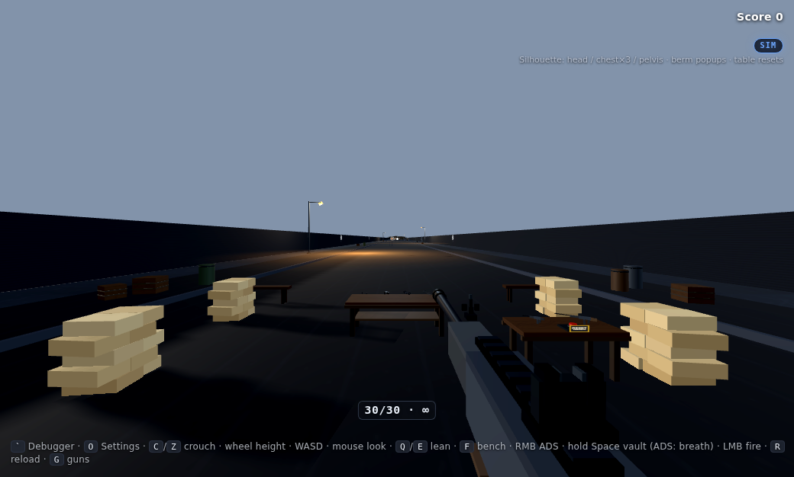
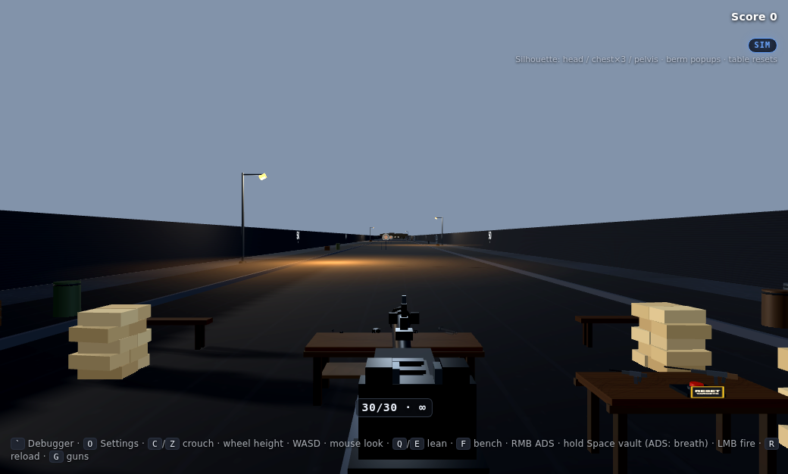
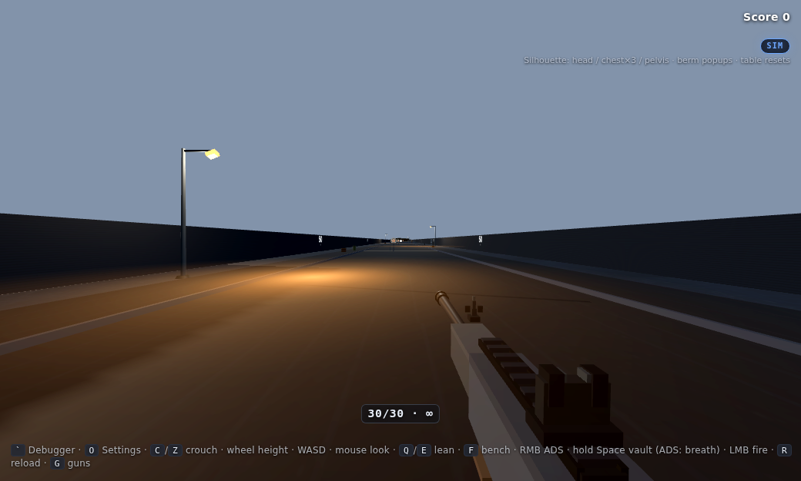

# Aim Offset / Weapon Viewmodel Debugger

Live-tune first-person **weapon hold poses** (hip, ADS, optics, attachments) so the gun on screen keeps the same promise as your bullets.

**Knowledge share for any FPS stack** — Unity, Unreal, Source-likes, custom engines. Not a plugin. Docs + math + schemas + a small reference tuner UI you can rebuild in your own tools.

### Browser tech demo

This repo is a knowledge-share plus a live Three.js shooting-range demo for proving viewmodel poses, ballistics (height-over-bore / zero), and common FPS feel — lean vs walls, reload, crouch, vault, lights. It is **not** a shipped multiplayer game.

Static HTML/JS, Three.js from CDN, no bundler — no compile step. Full run + Windows kiosk steps are in [How to run](#how-to-run). Short version: from [`reference/debugger/`](reference/debugger/) serve with `python3 -m http.server 8765`, open http://127.0.0.1:8765/, click the canvas for mouse look (pointer lock).







What the range is exercising:

- Two-tab **tuner** (`` ` ``) — live hip/ADS holds, attachments, Copy JSON
- ~400 m lane with fog (375/520 still hides long tracers), time of day + procedural sky (Settings `O`), procedural bay concrete, and shootable flood bulbs
- Berm-peak popup figures; **F** bench pickups (guns / optics / mags / suppressors / table reset)
- **R** reload (mag-out / slam-in); crouch / slide; wall-clamped lean; vault; Sim vs Arcade ballistics (HoB / zero)
- **SMG auto, in-line recoil** — **B** semi/auto (SMG only); hold LMB in AUTO (~1200 rpm)

Contracts here can travel to a real engine later. This demo is the feel lab.

### Start here

| Want… | Go |
|-------|-----|
| The problem in plain language | [Overview](docs/01-overview.md) |
| Formulas that render on GitHub | [Math reference](docs/07-math.md) |
| Clickable two-tab tuner layout | [Reference debugger](reference/debugger/) (`index.html`) |
| Data shape / JSON Schema | [Data model](docs/02-data-model.md) · [schemas/](schemas/) |
| Hotkeys & panel contract | [Tuner UX](docs/03-tuner-ux.md) |
| Unity / Unreal / custom checklist | [Engine glue](docs/05-engine-glue.md) |

### What are the common problems we face with first person weapon view models?

> FPS games often lie quietly: the camera aims one way, the iron sights sit another, and the muzzle / tracer tells a third story. This repo is an engine-agnostic knowledge share for **aim-offset / viewmodel tuning** — the data model, math, tuner workflow, and a small two-tab reference UI — so sight picture and trajectory stay honest. Works as a blueprint for Unity, Unreal, or a personal engine.

### What’s in the box

- Problem framing: camera aim vs viewmodel vs muzzle / trajectory  
- Philosophy: iron-sight accuracy promise, aesthetics vs honesty, all-FPS  
- Schemas + generic JSON/TOML examples  
- Portable math module (TypeScript)  
- Browser **View tuning / Attachments** reference debugger  

---

## Why this exists

Every FPS eventually hits the same quiet betrayal:

You look down the iron sights. The reticle (or the sight aperture) says the shot goes *here*. The **3D bullet** (trace, projectile, hitscan) is spawned from some point tied to the **camera** or a logical aim ray. The **muzzle** on the viewmodel gun is somewhere else in camera space. If those three disagree — screen aim, muzzle, and sim trajectory — players feel it instantly, even when they cannot name it.

That mismatch shows up as:

- Bullets that visibly leave the barrel but “hit” where the camera was looking (or the reverse)
- Hip fire that looks cool but has no honest relationship to where rounds go
- ADS that *looks* aligned until you fire and the tracer betrays you
- Optics that sit pretty on the rail but pull the sight picture off the true aim point

**Aim offsets / viewmodel hold poses** are how you reconcile **aesthetics** (how the gun sits in frame, how heavy it feels, how clean the iron-sight picture is) with **the accuracy promise**: when the sights say center mass, the trajectory should honor that.

This workflow treats that reconciliation as **content you tune live**, not magic numbers you recompile twenty times.

## The philosophy (good for all FPS games)

1. **One truth for aim.** Gameplay aim is a camera (or aim) ray. The viewmodel is a *presentation* of that truth, not a second competing shooter.
2. **Iron sights are a contract.** If you offer irons (or any optic), ADS is a promise: sight picture ↔ impact. Break that and the gun fantasy collapses.
3. **Hip fire is allowed to be expressive.** Hip poses can prioritize silhouette, brand, and motion — but they still need a known relationship to the aim ray (and often a visible hip reticle or clear bloom rules).
4. **Optics get their own poses.** Holo, ACOG, and scope eye relief are different fittings. One ADS pose plus FOV hacks is how you get “close enough” forever.
5. **Authored hold ≠ juice.** Sway, bob, and recoil are layers *on top of* tuned offsets. Do not bake noise into the numbers you ship.
6. **Engine-agnostic on purpose.** The math and the tuner loop are the same whether you are in Unity, Unreal, or a homemade renderer. Only parenting, input, and UI change.

If you are shipping any first-person shooter — arena, tac, horror, sci-fi, hybrid — this problem is yours. The module is written so the solution can travel.

## How you use the tool (the loop)

In play mode, with the real gun mesh and the real camera:

1. **Open the tuner** (debug hotkey / panel).
2. Pick **WEAPON** mode and the pose you care about (`hip`, `ads`, `ads_holo`, …) — or **ATTACHMENT** mode for grips / optics mounts.
3. **Nudge** position and rotation on one axis at a time with stepped precision (micro → coarse).
4. **Toggle ADS preview** and cycle optic profiles so you see the sight picture you are actually shipping.
5. Fire or draw debug traces from your **gameplay aim origin** and, if you want, from the **muzzle socket** — confirm the story matches: where the camera aims, where the barrel points, where the projectile goes.
6. **Copy** the tuned pose to the clipboard as paste-ready JSON/TOML and save it into your content files.
7. Keep procedural motion off (or minimal) while tuning so you are not chasing sway.

You stop guessing constants in a header file. You look through the sights, move the gun until honesty and beauty agree, and write that down as data.

## Mental model (30 seconds)

1. The **viewmodel root follows the camera** every frame.
2. A **hold pose** (position + euler rotation) comes from authored data: `hip` vs ADS poses.
3. ADS pose depends on the active **optic profile** (iron / holo / ACOG / sniper), with a documented fallback priority.
4. Blend with `ads_factor` in `0..1`: `pose = lerp(hip, ads_pose, ads_factor)`.
5. **Attachments** get local offsets (or sockets + offsets).
6. Bullets / traces use the **gameplay aim** (and optionally validate against muzzle); the viewmodel is dressed to sell that aim.
7. The **tuner** nudges live poses and **copies JSON/TOML** back to disk.

## Camera aim, muzzle, and trajectory

Three spaces people mix up:

| Idea | Role |
|------|------|
| **Camera / aim ray** | Gameplay truth — where the shot is *allowed* to go |
| **Viewmodel gun + irons/optic** | Player-facing aesthetics and the sight picture |
| **Muzzle / projectile spawn** | VFX and (sometimes) sim origin for projectiles |

A healthy FPS picks an explicit policy, for example:

- Hitscan / traces from camera (or a stable aim point), viewmodel tuned so irons sit on that ray at ADS
- Projectiles spawned at muzzle but **direction** taken from aim ray (common compromise)
- True muzzle-authoritative ballistics only when the viewmodel and camera are rigorously locked together

Whatever you choose, **document it**, then use aim-offset tuning so the **visible gun does not lie** about that policy. The debugger is how you keep the iron-sight promise under that policy without destroying hip-fire framing.

## Who this is for

- Anyone building or prototyping FPS / hybrid viewmodels in any engine
- Teams that want a clear data model before writing Editor tools
- Developers tired of “tweak, compile, playtest, forget which axis”

## Repo map

| Path | What |
|------|------|
| [`docs/`](docs/) | Knowledge share — overview, data model, tuner UX, frame pipeline, engine glue, contracts, math |
| [`docs/01-overview.md`](docs/01-overview.md) | Problem, philosophy, usage in depth |
| [`docs/02-data-model.md`](docs/02-data-model.md) | Pose + weapon + attachment schemas |
| [`docs/03-tuner-ux.md`](docs/03-tuner-ux.md) | Recommended hotkey / panel contract |
| [`docs/04-frame-pipeline.md`](docs/04-frame-pipeline.md) | Pseudocode for one frame |
| [`docs/05-engine-glue.md`](docs/05-engine-glue.md) | Unity / Unreal / custom checklists |
| [`docs/06-contracts-and-gotchas.md`](docs/06-contracts-and-gotchas.md) | Axes, defaults, retune hazards |
| [`docs/07-math.md`](docs/07-math.md) | Shared formulas (lerp, slerp, optic select, aim vs muzzle) |
| [`schemas/`](schemas/) | JSON Schema (`weapon-offset-config.schema.json`) |
| [`examples/`](examples/) | Sample JSON/TOML (+ range screenshots) |
| [`reference/viewmodel_math.ts`](reference/viewmodel_math.ts) | Portable math module — port freely |
| [`reference/debugger/`](reference/debugger/) | Live Three.js range + tuner |
| [`reference/debugger/index.html`](reference/debugger/index.html) | Page shell |
| [`reference/debugger/app.js`](reference/debugger/app.js) | Demo + tuner logic |
| [`reference/debugger/styles.css`](reference/debugger/styles.css) | UI chrome |
| [`reference/debugger/StartServer.bat`](reference/debugger/StartServer.bat) | Windows kiosk launcher (Firefox) |

## Quick start

1. [How to run](#how-to-run) the live range (local serve or Windows kiosk).
2. Skim the [platform / format chart](#platform--format-outputs) for what you can ship from this repo today.
3. Read [overview](docs/01-overview.md) + [data model](docs/02-data-model.md).
4. Copy [`examples/example_smg.toml`](examples/example_smg.toml) into your content pipeline.
5. Implement the [frame pipeline](docs/04-frame-pipeline.md) in your engine; use [engine glue](docs/05-engine-glue.md) checklists.
6. Add the [tuner UX](docs/03-tuner-ux.md) (IMGUI, egui, UMG, Editor window — your call).
7. Keep [contracts](docs/06-contracts-and-gotchas.md) taped above your monitor.
8. Implement against [math](docs/07-math.md) / [`reference/viewmodel_math.ts`](reference/viewmodel_math.ts).

## How to run

Honest setup: **no compile step**. The demo is static HTML/JS with Three.js from a CDN.

### Dev loop

From [`reference/debugger/`](reference/debugger/):

```bash
python3 -m http.server 8765
```

Open http://127.0.0.1:8765/ and click the canvas for mouse look (pointer lock). When `app.js` changes (cache-bust query like `app.js?v=`), hard-refresh the page so you are not fighting an old script.

### Kiosk (Windows)

[`reference/debugger/StartServer.bat`](reference/debugger/StartServer.bat):

- Serves `127.0.0.1:8765` from the debugger folder
- Waits until the server answers, then launches Firefox `-kiosk` with a dedicated profile under `%LOCALAPPDATA%\aim-offset-kiosk` (so homepage / Google is not tab 1)
- **Alt+F4** exits the kiosk window; the script then kills **only** the listener on port 8765

Needs Mozilla Firefox. If behavior is weird (profile locked, wrong window), close other Firefox instances first and run the bat again.

## Output formats you have now

Nothing here builds a second binary. Clipboard + files + the live page:

| Output | Where |
|--------|--------|
| Live page | Only runtime artifact — `reference/debugger/` in a browser |
| Tuner Copy JSON | Backtick debugger → copy tuned pose |
| Settings → Copy settings (`O`) | Writes / reads `aimOffset.settings` in `localStorage` |
| Example content | [`examples/`](examples/) JSON + TOML |
| Schema | [`schemas/weapon-offset-config.schema.json`](schemas/weapon-offset-config.schema.json) |

## Platform / format outputs

| Target | Status | Notes / effort |
|--------|--------|----------------|
| Local browser serve | Ready now | `python3 -m http.server` from `reference/debugger/` |
| Firefox kiosk (`StartServer.bat`) | Ready now | Windows; dedicated profile; Alt+F4 exits |
| Static host (GitHub Pages / Netlify / itch.io HTML5 / any static CDN) | Near-ready | Drop `reference/debugger/`; needs HTTPS + CDN reach for Three.js |
| Pose / settings JSON (+ TOML examples) | Ready now | Content pipeline input |
| JSON Schema validation | Ready now | Validate authored configs before engine import |
| TypeScript math module | Ready as reference | Port freely into any language |
| PWA / installable web | Small future tweak | Manifest + service worker on the same static files |
| Desktop shell (Electron / Tauri) | Small wrap | Same static demo, windowed — thin host around the page |
| Unity / Unreal / custom engine | Docs + math + schema today | Glue checklists in [`docs/05-engine-glue.md`](docs/05-engine-glue.md); no binary build in this repo |
| Dedicated engine / custom host merge | Planned | Keep data model + feel contracts; rehost the renderer later (engine port) |

## One core, many shells

Prefer one airtight static core and portable data so each target is a thin shell, not a rewrite. Keep the demo modern and malleable — if it can run on a notepad, we are gods — rather than chasing every platform binary today. Browser knowledge-share first; dedicated engine / custom host merge later, carrying the same pose contracts and math.

## What this is not

- Not a full debugger binary
- Not a dump of any proprietary game project
- Not mesh / animation / IP packs

The portable value is the **workflow + schema + math**. Engine UI adapters can come later; the formulas are already here.

## License

MIT — see [LICENSE](LICENSE).
